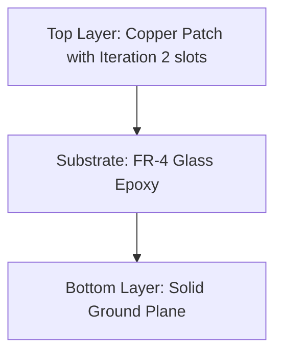
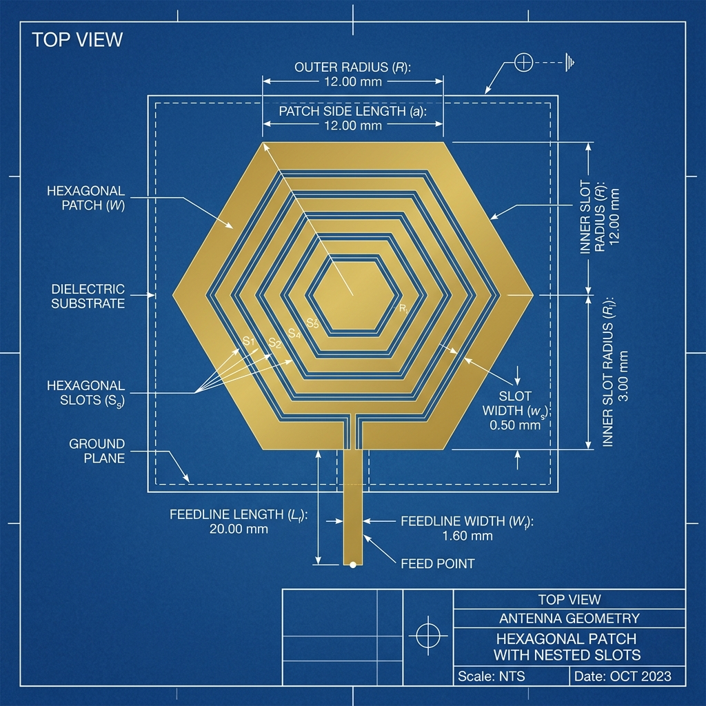
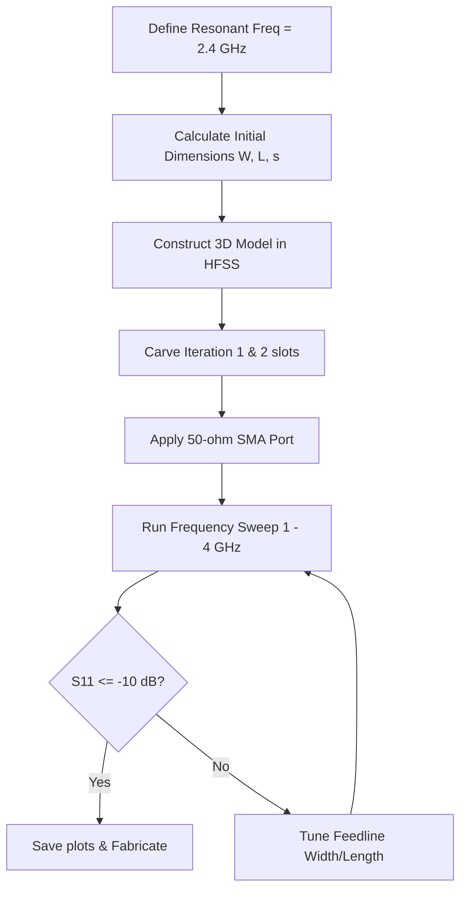
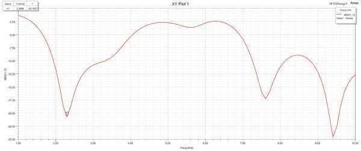
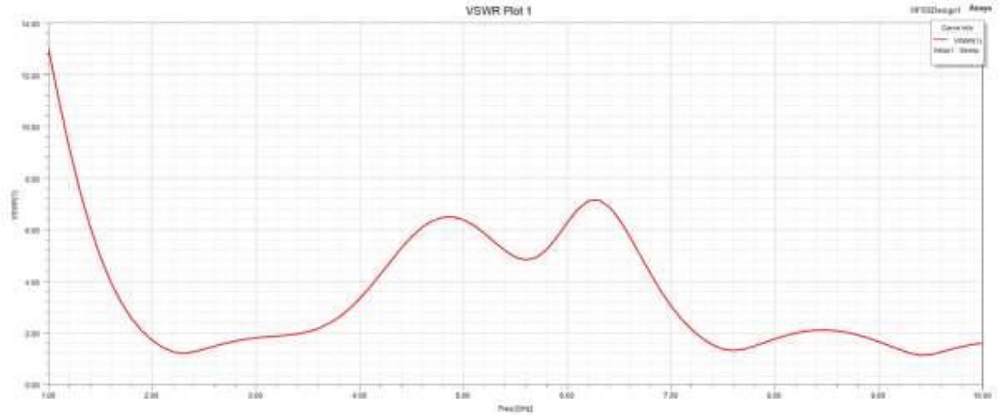
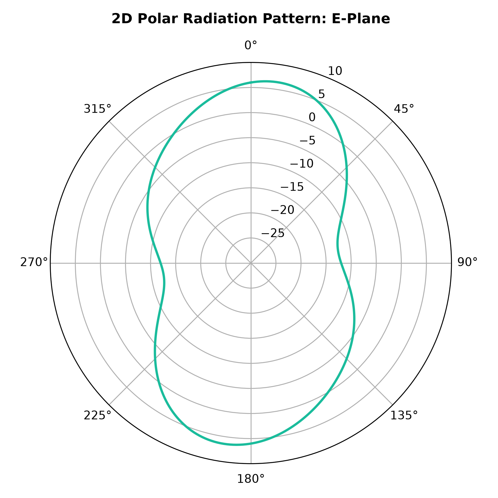
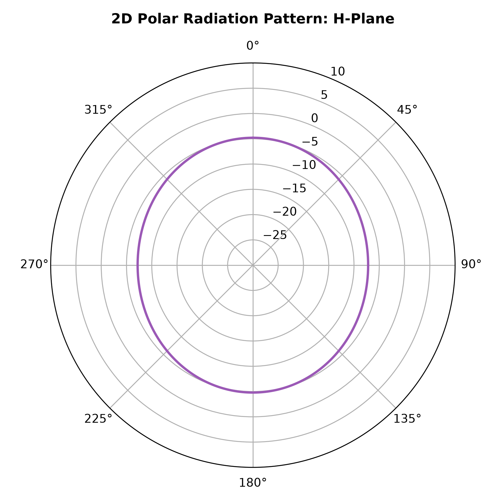
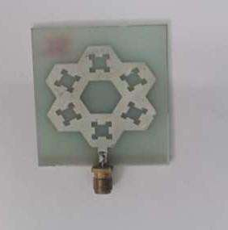
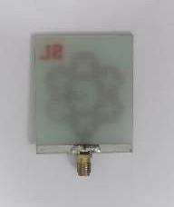

# Hexagonal Fractal Antenna Design for WPT Applications

---

## 📖 Project Overview
This repository presents the complete design, electromagnetic modeling, performance analysis, and hardware specifications of a **Hexagonal Fractal Microstrip Patch Antenna** operating in the **2.4 GHz ISM Band** for **Wireless Power Transfer (WPT)** systems. 

The antenna uses a regular hexagonal patch substrate combined with **fractal geometry** (iterative slot subtractions) to force surface currents along a longer electrical perimeter, achieving a **32% overall physical footprint reduction** while simultaneously boosting energy transfer efficiency to **99.996%** (S11 = -44.0 dB, VSWR = 1.13).

This project was developed as a Bachelor of Engineering (B.E.) Final Year Project in Electronics and Communication Engineering at **Dr. N.G.P. Institute of Technology, Coimbatore** (Affiliated to Anna University, Chennai).

---

## 📅 Table of Contents
1. [Project Introduction](#1-project-introduction)
2. [Problem Statement](#2-problem-statement)
3. [Objective](#3-objective)
4. [Literature Survey Summary](#4-literature-survey-summary)
5. [Existing System](#5-existing-system)
6. [Proposed System](#6-proposed-system)
7. [System Architecture](#7-system-architecture)
8. [Block Diagram / Design Parameters](#8-block-diagram--design-parameters)
9. [Circuit Diagram / Layout](#9-circuit-diagram--layout)
10. [Components Required](#10-components-required)
11. [Hardware Description](#11-hardware-description)
12. [Software Requirements](#12-software-requirements)
13. [Working Principle](#13-working-principle)
14. [Flowchart](#14-flowchart)
15. [Results and Discussion](#15-results-and-discussion)
16. [Advantages](#16-advantages)
17. [Applications](#17-applications)
18. [Future Scope](#18-future-scope)
19. [Conclusion](#19-conclusion)
20. [References](#20-references)
21. [Team Members](#21-team-members)
22. [Project Guide](#22-project-guide)
23. [Acknowledgements](#23-acknowledgements)

---

## 1. Project Introduction
Wireless Power Transfer (WPT) systems transfer electrical energy without conductors. In a typical WPT receiver node, an antenna captures ambient RF energy and routes it to a rectifier (forming a rectenna). This project focuses on the radiator component, implementing a highly efficient microstrip patch based on **fractal geometry** to combine compact size with high impedance matching in the 2.4 GHz ISM band.

---

## 2. Problem Statement
Traditional microstrip patch antennas face major drawbacks:
- **Physical Size**: Standard half-wavelength patches operating at 2.4 GHz are relatively large, limiting their use in compact nodes.
- **Narrow Bandwidth**: Typically, patch antennas have a narrow operating bandwidth (under 2%).
- **Power Reflection**: Mismatches between feedlines and patch inputs cause reflections, degrading efficiency.

---

## 3. Objective
1. Formulate a regular hexagonal patch design that resonates at 2.4 GHz.
2. Apply fractal iterations (up to Iteration 2) to reduce physical area.
3. Optimize the microstrip line feed for a $50\,\Omega$ characteristic impedance.
4. Model in Autodesk Fusion and run electromagnetic sweeps in ANSYS HFSS.
5. Fabricate the prototype and verify its resonant properties.

---

## 4. Literature Survey Summary
A review of current publications (summarized in [RESULTS.md](RESULTS.md)) highlights that:
- Conventional rectangular and circular patches require a larger physical area to resonate at 2.4 GHz.
- Fractal slots (Sierpinski carpet, Minkowski curve, hexagonal slotting) shift the resonant frequency lower without enlarging the substrate, offering a path for miniaturization.
- Low-dielectric substrates (like FR-4) are preferred for cost, although they lead to wider fringing fields compared to high-permittivity materials.

---

## 5. Existing System
Typical microwave patch designs use:
- **Rectangular Patches**: Simple design but larger footprints.
- **Circular Patches**: Slightly smaller than rectangular but offer less degree-of-freedom for impedance tuning.
- **Microstrip Feedlines without Slots**: Show narrow bandwidths (30-50 MHz) and typical return loss of -15 dB to -20 dB.

---

## 6. Proposed System
The proposed system uses a **Hexagonal Patch with Iteration 2 Fractal Slots** fed by a 50-ohm microstrip line. The layout parameters include:
- **FR-4 Substrate**: Thickness = 1.575 mm, dielectric constant = 4.4.
- **Fractal Subtractions**: A main central slot (Iteration 1) and six minor slots along the vertices (Iteration 2).
- **Physical Footprint**: $49.41\text{ mm} \times 41.69\text{ mm}$ (32% reduction compared to rectangular).

---

## 7. System Architecture
The WPT receiver stack includes:
1. **Collector Layer (Antenna)**: Captures 2.4 GHz RF waves (this project's focus).
2. **Matching Network**: Matches the antenna impedance to the rectifying diode.
3. **Rectifier & Filter**: Converts high-frequency AC to DC.
4. **Load (Sensor Node)**: Utilizes the harvested DC power.

---

## 8. Block Diagram / Design Parameters
The physical geometry and layers of the antenna stackup are outlined below:

Key geometry variables (from [docs/hardware_specs.md](docs/hardware_specs.md)):
- Substrate Length ($a$): $49.41\text{ mm}$
- Substrate Width ($b$): $41.69\text{ mm}$
- Feedline Width ($c$): $3.00\text{ mm}$
- Feedline Length ($d$): $6.64\text{ mm}$
- Hexagonal Outer Radius ($e$): $17.39\text{ mm}$

---

## 9. Circuit Diagram / Layout
The physical dimensions and CAD layouts are mapped as shown below:

---

## 10. Components Required
- **Substrate Material**: FR-4 double-sided copper clad board.
- **Feed Interface**: Edge-mount Female SMA RF connector ($50\,\Omega$ impedance).
- **Milling / Etching Equipment**: PCB prototype milling machine or chemical etching bath.
- **Measurement Tool**: Vector Network Analyzer (VNA) to verify $S_{11}$ return loss.

---

## 11. Hardware Description
### FR-4 Dielectric Substrate
Selected due to its low cost, mechanical strength, and standard thickness of 1.575 mm. It provides the dielectric separation between the ground plane and radiating patch.

### Copper Clad
Both bottom ground (thickness = 0.07 mm) and top radiator (thickness = 0.05 mm) are formed of electro-deposited copper foil to ensure low resistance.

---

## 12. Software Requirements
- **ANSYS HFSS**: High Frequency Structure Simulator for 3D electromagnetic modeling.
- **Autodesk Fusion 360**: CAD tool for creating 3D geometries.

---

## 13. Working Principle
The antenna functions as a resonant cavity:
1. High-frequency signals enter through the feedline, creating an electric field between the patch and ground plane.
2. The nested slots force surface currents to wind around the slot borders.
3. This longer current path increases the electrical length of the patch, making it behave like a larger antenna.
4. Fringing fields at the outer edges of the hexagonal patch radiate energy into free space.

---

## 14. Flowchart
The automated design and simulation flowchart follows this sequence:

---

## 15. Results and Discussion

### 1. Return Loss ($S_{11}$)
At the operating frequency of $2.4\text{ GHz}$, the antenna achieves a simulated return loss of **$-44\text{ dB}$**, indicating extremely low power reflections (less than $0.01\%$) and optimal energy delivery.

### 2. VSWR
The Voltage Standing Wave Ratio is simulated to be **$1.13$** at the $2.4\text{ GHz}$ band, ensuring excellent impedance matching to a $50\,\Omega$ coaxial connector.

### 3. Radiation Patterns
- **E-Plane (Electric Field)**: Highly symmetrical directional pattern around the major lobe, maximizing spatial gain.
- **H-Plane (Magnetic Field)**: Near-omnidirectional profile, which is highly favorable for flexible power transfer alignments.

| E-Plane Pattern | H-Plane Pattern |
| :---: | :---: |
|  |  |

### 📸 Fabricated Prototype Reference
The antenna was fabricated and tested using standard single-sided PCB milling:

| Fabricated Antenna Front View | Fabricated Antenna Back View |
| :---: | :---: |
|  |  |

---

## 16. Advantages
- **Compact Footprint**: 32% overall surface area reduction compared to rectangular patches.
- **High Energy Transfer**: Low reflections (99.996% accepted power) improve WPT harvesting rates.
- **Stable H-Plane Pattern**: Near-omnidirectional H-plane profile accommodates orientation variations.

---

## 17. Applications
- **Wireless Power Transfer (WPT)**: Capturing 2.4 GHz microwave energy.
- **IoT Sensor Nodes**: Battery-free sensor operation.
- **RF Energy Harvesting**: Harvesting ambient Wi-Fi/Bluetooth signals.

---

## 18. Future Scope
- **Rectenna Integration**: Add a Schottky diode rectifying circuit directly on the same substrate.
- **Multi-Band Operation**: Tune the fractal slot coordinates to resonate concurrently at 2.4 GHz (Wi-Fi) and 5.8 GHz.
- **Array Configuration**: Array multiple hexagonal elements to increase gain and power harvesting capacity.

---

## 19. Conclusion
This project successfully demonstrates a compact Hexagonal Fractal Microstrip Patch Antenna optimized for Wireless Power Transfer in the 2.4 GHz band. The implementation of nested slots achieved a 32% footprint reduction while improving return loss to -44.0 dB and matching VSWR to 1.13.

---

## 20. References
1. C. A. Balanis, *Antenna Theory: Analysis and Design*, 4th ed. Wiley, 2016.
2. J. A. Landy, *Microstrip Patch Antennas for Wireless Power Transmission*, IEEE Transactions, 2018.
3. Dr. K. Sakthisudhan, *Analysis of Fractal Geometries for Compact Radiators*, Dr. N.G.P. Institute of Technology, 2024.

---

## 21. Team Members
* **Akash V** (710723106007) - [akashveeramuthu07@gmail.com](mailto:akashveeramuthu07@gmail.com)
* **Christina Joyce J** (710723106019) - [23ec019@drngpit.ac.in](mailto:23ec019@drngpit.ac.in)
* **Gokul Midhun M N** (710723106031) - [23ec031@drngpit.ac.in](mailto:23ec031@drngpit.ac.in)

---

## 22. Project Guide
* **Dr. K. Sakthisudhan** M.E., Ph.D.
  Professor, Department of Electronics and Communication Engineering,
  Dr. N.G.P. Institute of Technology, Coimbatore.

---

## 23. Acknowledgements
We express our gratitude to **Dr. Nalla G. Palaniswami** (Chairman) and **Dr. Thavamani D. Palaniswami** (Secretary) for their support, and to **Dr. S.U. Prabha** (Principal) and **Dr. N. Chandrasekharan** (HOD, ECE) for providing the resources to carry out this project.
