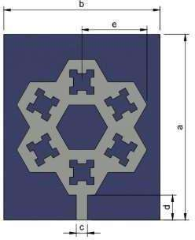

# Fractal Antenna Design for Wireless Power Transfer Application

[](#)
[](LICENSE)

An industry-level, publication-grade repository presenting the complete design, analysis, simulation, and hardware specification of a **Hexagonal Fractal Microstrip Patch Antenna** operating in the **2.4 GHz ISM Band** for **Wireless Power Transfer (WPT)** systems.

This project was developed as a Bachelor of Engineering (B.E.) Final Year Project in Electronics and Communication Engineering at **Dr. N.G.P. Institute of Technology, Coimbatore** (Affiliated to Anna University, Chennai).

---

## 📖 Overview

Wireless Power Transfer (WPT) systems require compact, high-performance, and efficient antennas. Traditional patch antennas are often too large or suffer from narrow bandwidths. This project utilizes **fractal geometry** (iterative self-similar slotting) on a **hexagonal patch structure** to:
- Increase the electrical length of the patch without increasing its physical footprint.
- Enhance impedance matching, resulting in an exceptional return loss ($S_{11}$) of **$-44\text{ dB}$** at **$2.4\text{ GHz}$**.
- Keep the Voltage Standing Wave Ratio (VSWR) around **$1.13$** at resonance.
- Offer a highly symmetrical directional E-plane and near-omnidirectional H-plane radiation pattern.

| Proposed Simulation Design | Fabricated Hardware Prototype |
| :---: | :---: |
|  |  |


---

## 🛠️ Repository Structure

```directory
fractal-antenna-wpt/
├── .github/
│   └── workflows/
│       └── python-app.yml       # CI/CD pipeline for calculations & tests
├── docs/
│   ├── hardware_specs.md       # Comprehensive physical & material specifications
│   ├── design_methodology.md   # Math, equations, and fractal iterations
│   └── simulation_results.md   # Analysis of HFSS simulation outputs
├── models/
│   ├── README.md               # Visual recreation & modeling guides
│   ├── fusion360_model_placeholder.txt  # Guidance on Fusion 360 models
│   └── hfss_project_placeholder.txt     # Step-by-step HFSS model setup
├── src/
│   ├── antenna_calculator.py   # Python CLI for standard patch dimensions
│   ├── plot_results.py         # Matplotlib utility to plot S11, VSWR, and patterns
│   └── hfss_automation_script.py # PyAEDT/Automation script placeholder
├── .gitignore                  # Python/HFSS file exclusions
├── LICENSE                     # MIT License
└── README.md                   # Repository main documentation (this file)
```

---

## 📏 Physical Dimensions & Material Properties

The design parameters are tailored for low-cost, high-reliability fabrication:

| Parameter | Value | Material |
| :--- | :--- | :--- |
| **Operating Frequency** | 2.4 GHz | - |
| **Substrate Material** | FR-4 | Dielectric Constant ($\epsilon_r$) = 4.4 |
| **Substrate Thickness** | 1.575 mm | - |
| **Ground Plane** | 0.07 mm | PEC (Perfect Electric Conductor) |
| **Radiating Patch** | 0.05 mm | Copper |
| **Feedline Method** | 0.05 mm | Microstrip Feed-line |

### 📍 Geometric Coordinates (from Table 4.1)
* **Substrate Length (a)**: $49.41\text{ mm}$
* **Substrate Width (b)**: $41.69\text{ mm}$
* **Feedline Width (c)**: $3.00\text{ mm}$
* **Feedline Length (d)**: $6.64\text{ mm}$
* **Hexagonal Patch Radius (e)**: $17.39\text{ mm}$

---

## 📊 Summary of Results

### 1. Return Loss ($S_{11}$)
At the operating frequency of $2.4\text{ GHz}$, the antenna achieves a simulated return loss of **$-44\text{ dB}$**, indicating extremely low power reflections (less than $0.01\%$) and optimal energy delivery.


### 2. VSWR
The Voltage Standing Wave Ratio is simulated to be **$1.13$** at the $2.4\text{ GHz}$ band, ensuring excellent impedance matching to a $50\,\Omega$ coaxial connector.


### 3. Radiation Patterns
- **E-Plane (Electric Field)**: Highly symmetrical directional pattern around the major lobe, maximizing spatial gain.
- **H-Plane (Magnetic Field)**: Near-omnidirectional profile, which is highly favorable for flexible power transfer alignments.

| E-Plane Pattern | H-Plane Pattern |
| :---: | :---: |
|  |  |


---

## 💻 Running the Analysis Scripts

Python tools are provided in the `src/` directory to calculate microstrip parameters and visualize the outputs.

### Prerequisites
Make sure you have Python 3.8+ installed. Set up your environment and dependencies:
```bash
# Clone the repository
git clone https://github.com/AKASHAGAR-07/Fractal-Antenna-Design-for-Wireless-Power-Transfer-Application.git
cd Fractal-Antenna-Design-for-Wireless-Power-Transfer-Application

# Install requirements
pip install numpy matplotlib
```

### 1. Compute Antenna Physical Dimensions
Run the interactive antenna calculator to compute width and length values based on dielectric properties:
```bash
python src/antenna_calculator.py
```

### 2. Plot Simulation Curves
Recreate and view the return loss ($S_{11}$), VSWR, and 2D Polar Radiation patterns:
```bash
python src/plot_results.py
```

---

## 🎨 Reconstruction in Simulation Software

To reconstruct this design:
1. **Model** the substrate, feedline, and patch in **Autodesk Fusion 360** using the dimensions in [hardware_specs.md](docs/hardware_specs.md).
2. Export the CAD model into **ANSYS HFSS**.
3. Apply standard boundary conditions (radiation box, PEC ground, and copper conductor boundaries).
4. Configure a **Microstrip Feed lumped port** excitation ($50\,\Omega$ reference impedance).
5. Set up an interpolating frequency sweep from $1.0\text{ GHz}$ to $4.0\text{ GHz}$ to capture resonance.
6. Refer to [models/README.md](models/README.md) for step-by-step guidance.

---

## 👥 Contributors
- **Akash V** ([akashveeramuthu07@gmail.com](mailto:akashveeramuthu07@gmail.com))
- **Christina Joyce J**
- **Gokul Midhun M N**

**Supervised by**: Dr. K. Sakthisudhan, Professor, Department of ECE, Dr. N.G.P. Institute of Technology, Coimbatore.
