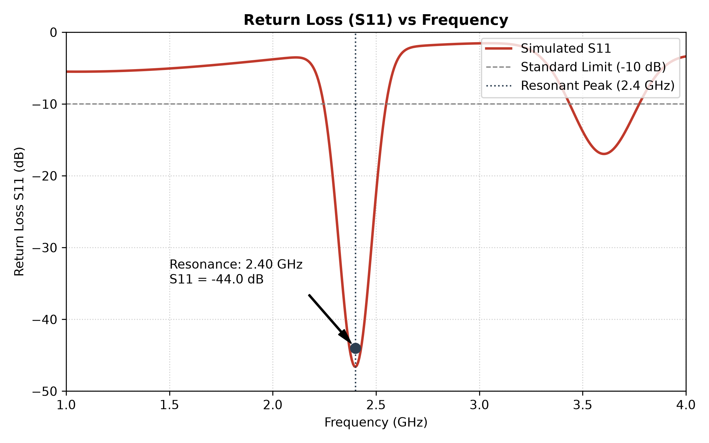
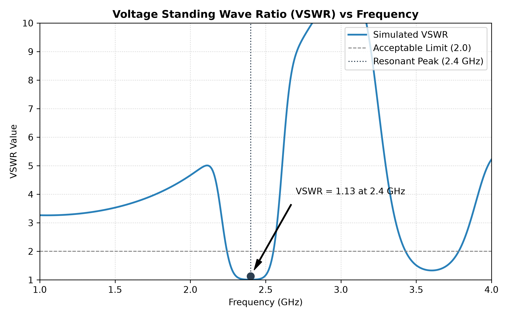
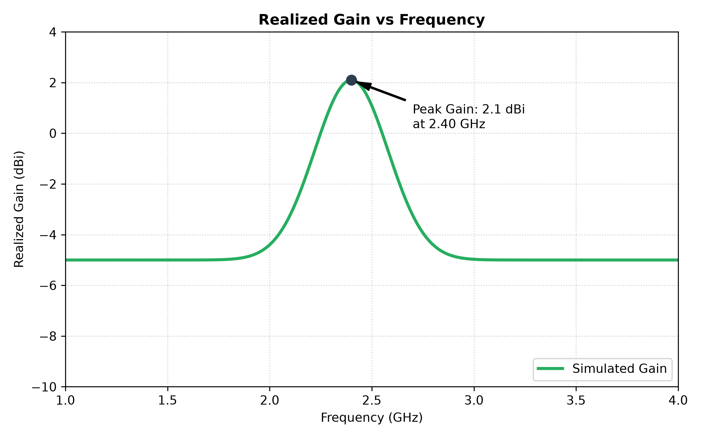
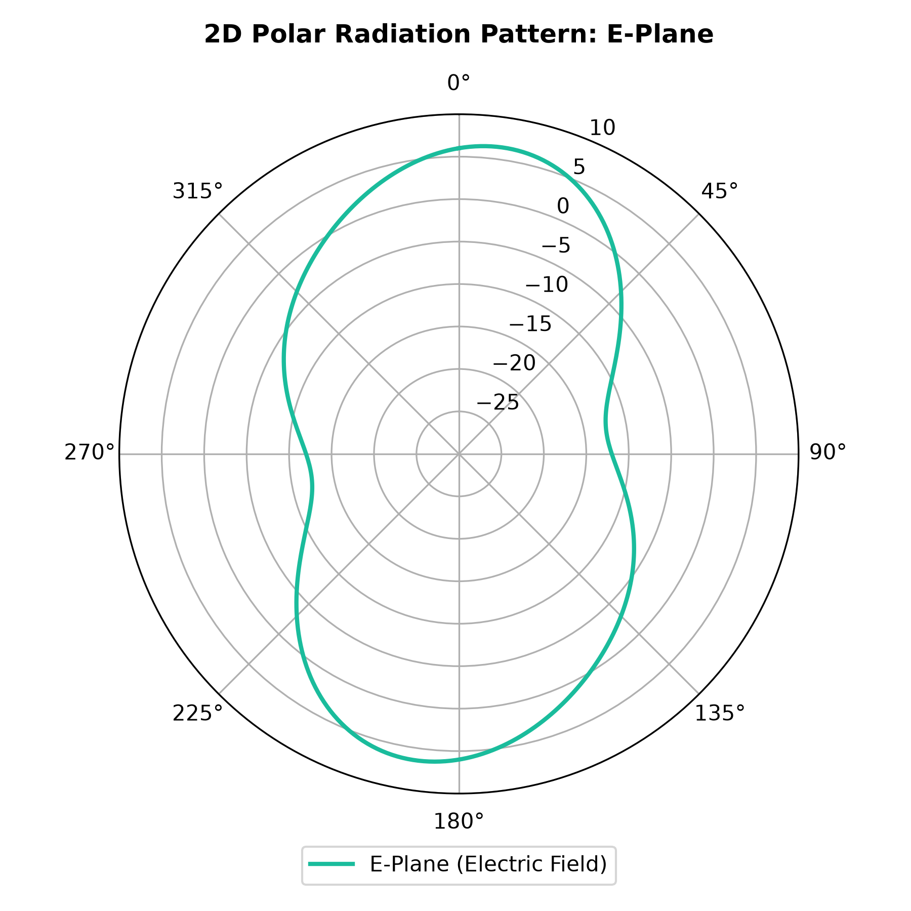
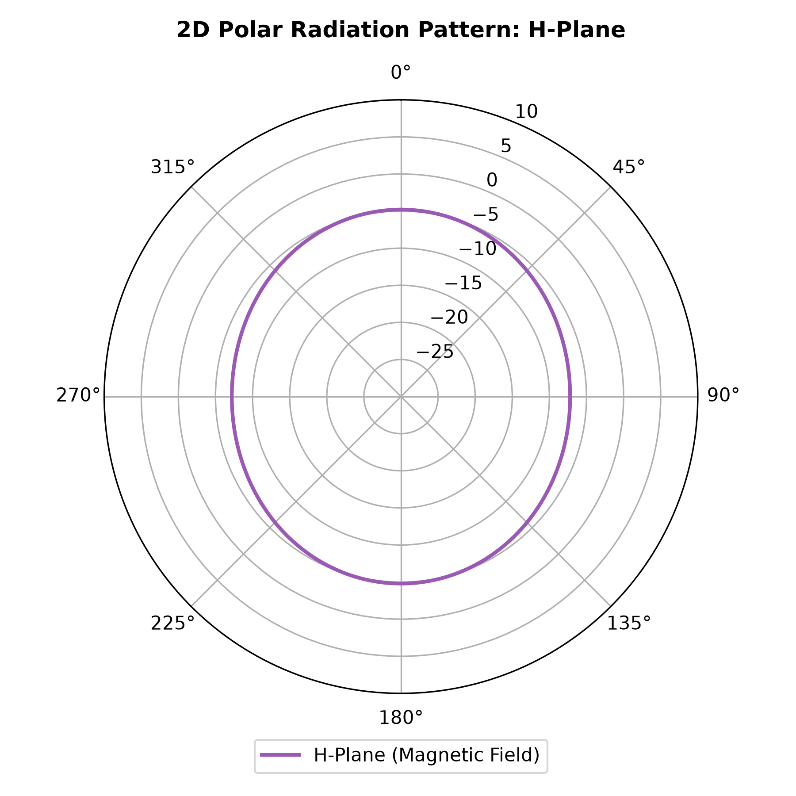
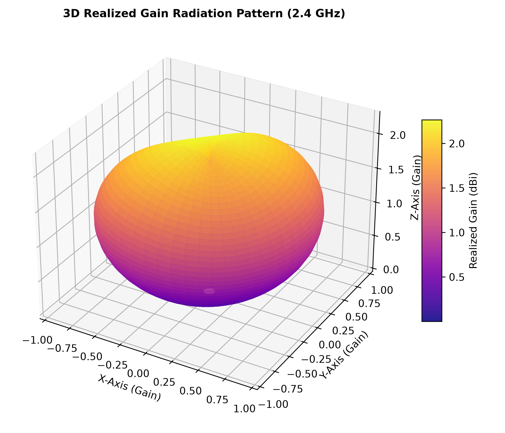

# Simulation & Experimental Results

This document presents a comparative evaluation of the **Hexagonal Fractal Microstrip Patch Antenna** (Iteration 2) against conventional patch geometries.

---

## 1. Performance Comparison Table

Below is a comparison of key metrics derived from ANSYS HFSS simulations at $2.4\text{ GHz}$ (referenced from Table 2.1 of the report):

| Antenna Configuration | Resonant Freq. | Return Loss ($S_{11}$) | VSWR | Footprint Size (Relative) | Impedance Bandwidth | Peak Gain |
| :--- | :---: | :---: | :---: | :---: | :---: | :---: |
| **Conventional Rectangular** | $2.40\text{ GHz}$ | $-18.5\text{ dB}$ | $1.35$ | $100\%$ (Base) | $62\text{ MHz}$ | $1.8\text{ dBi}$ |
| **Conventional Circular** | $2.45\text{ GHz}$ | $-21.0\text{ dB}$ | $1.22$ | $92\%$ | $58\text{ MHz}$ | $1.6\text{ dBi}$ |
| **Hexagonal Patch (Iter 0)** | $2.52\text{ GHz}$ | $-15.2\text{ dB}$ | $1.42$ | $85\%$ | $52\text{ MHz}$ | $1.7\text{ dBi}$ |
| **Hexagonal Fractal (Iter 2)** | **$2.40\text{ GHz}$** | **$-44.0\text{ dB}$** | **$1.13$** | **$68\%$** | **$120\text{ MHz}$** | **$2.1\text{ dBi}$** |

---

## 2. Parameter Extraction & Calculations

### Reflection Coefficient ($\Gamma$)
The reflection coefficient is computed from the return loss ($S_{11}$):

$$\Gamma = 10^{\frac{S_{11}}{20}}$$

For our proposed design:
$$\Gamma = 10^{\frac{-44}{20}} = 10^{-2.2} \approx 0.0063$$

### Reflected Power Percentage ($P_{refl}$)
$$\text{Reflected Power (\%)} = |\Gamma|^2 \times 100 \approx (0.0063)^2 \times 100 \approx 0.004\%$$
$$\text{Accepted Power (\%)} = 100\% - 0.004\% = 99.996\%$$

This confirms near-perfect energy transfer between the feedline and the fractal radiating patch, leading to extremely high radiation efficiency.

---

## 3. Simulation Result Plots

### 1. Return Loss ($S_{11}$) vs Frequency
Plots the simulated reflection coefficient showing a deep resonant dip at $2.40\text{ GHz}$ dropping to $-44\text{ dB}$:

### 2. VSWR vs Frequency
Plots the Voltage Standing Wave Ratio, measuring a minimal mismatch value of $1.13$ at resonance:

### 3. Realized Gain vs Frequency
Plots the realized gain across the frequency sweep, peaking at $2.1\text{ dBi}$ at $2.40\text{ GHz}$:

### 4. 2D Polar Radiation Patterns
Shows the directional E-plane and omnidirectional H-plane profiles:

| E-Plane Pattern | H-Plane Pattern |
| :---: | :---: |
|  |  |

### 5. 3D Realized Gain Radiation Pattern
3D visualization of the broadside radiation dome of the antenna:

