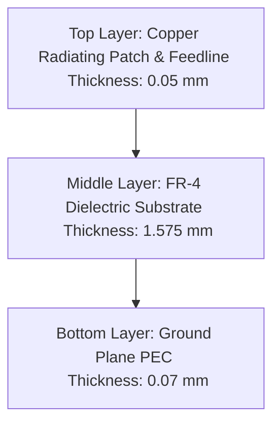

# Hardware Specifications

This document provides complete, industry-standard physical and material specifications for the Hexagonal Fractal Microstrip Patch Antenna.

---

## 🏗️ Layer Stackup

The antenna structure is designed as a three-layer microstrip board, consisting of a ground plane on the bottom, a dielectric substrate in the middle, and the radiating patch with a microstrip feedline on the top.

---

## 🧪 Material Properties

### 1. Substrate: FR-4 (Flame Retardant 4)
FR-4 is selected due to its low cost, widespread availability, and mechanical robustness.
* **Dielectric Constant ($\epsilon_r$)**: $4.4 \pm 0.1$
* **Loss Tangent ($\tan \delta$)**: $0.02$ (typical for standard FR-4 at microwave frequencies)
* **Thickness ($h$)**: $1.575\text{ mm}$

### 2. Radiating Patch & Feedline: Copper
High electrical conductivity ensures low ohmic loss and maximum radiation efficiency.
* **Material**: Electro-deposited copper foil
* **Electrical Conductivity ($\sigma$)**: $5.8 \times 10^7\text{ S/m}$
* **Thickness ($t_p$)**: $0.05\text{ mm}$ (approx. 1.4 oz copper)

### 3. Ground Plane: PEC (Perfect Electric Conductor)
Modeled as a perfect conductor to maximize reflections towards the upper half-space and minimize back radiation.
* **Material**: PEC (Idealized) / Copper (Fabrication)
* **Thickness ($t_g$)**: $0.07\text{ mm}$ (approx. 2.0 oz copper)

---

## 📏 Detailed Geometric Dimensions

The parameters listed below refer to the structural model diagram in the design methodology guide:

| Parameter Sym. | Description | Numerical Value (mm) |
| :--- | :--- | :--- |
| **$a$** | Substrate / Ground Plane Length | $49.41\text{ mm}$ |
| **$b$** | Substrate / Ground Plane Width | $41.69\text{ mm}$ |
| **$c$** | Feedline Width (designed for $50\,\Omega$ impedance matching) | $3.00\text{ mm}$ |
| **$d$** | Feedline Length | $6.64\text{ mm}$ |
| **$e$** | Reconfigured Hexagonal Patch Outer Radius (Outer edge length) | $17.39\text{ mm}$ |

---

## 🔌 Excitation & Connector Interface

To translate the simulated design into physical hardware:
- **Connector Type**: Edge-mount Female SMA (SubMiniature version A) RF Connector.
- **Characteristic Impedance ($Z_0$)**: $50\,\Omega$.
- **Termination/Pin Connection**:
  - Center pin soldered directly onto the microstrip feedline (width $c = 3.00\text{ mm}$).
  - Outer body legs clamped and soldered onto the ground plane (bottom layer) and ground pads.
- **Excitation Mode in Simulation**:
  - In HFSS, a **lumped port** or **wave port** is defined between the microstrip feed line and the ground plane, referencing $50\,\Omega$.

---

## 📸 Fabricated Prototype Reference
As described in Section 4.2.7 of the project report, the antenna was fabricated using standard single-sided PCB milling / photo-lithography:
- **Front View**: Features the copper hexagonal patch with nested self-similar slots (fractal iteration) fed by a 50-ohm microstrip feedline connected to a brass SMA edge launcher.
- **Back View**: Features the uniform, unbroken PEC copper ground plane, ensuring a solid return path for electrical currents and minimizing back radiation.
